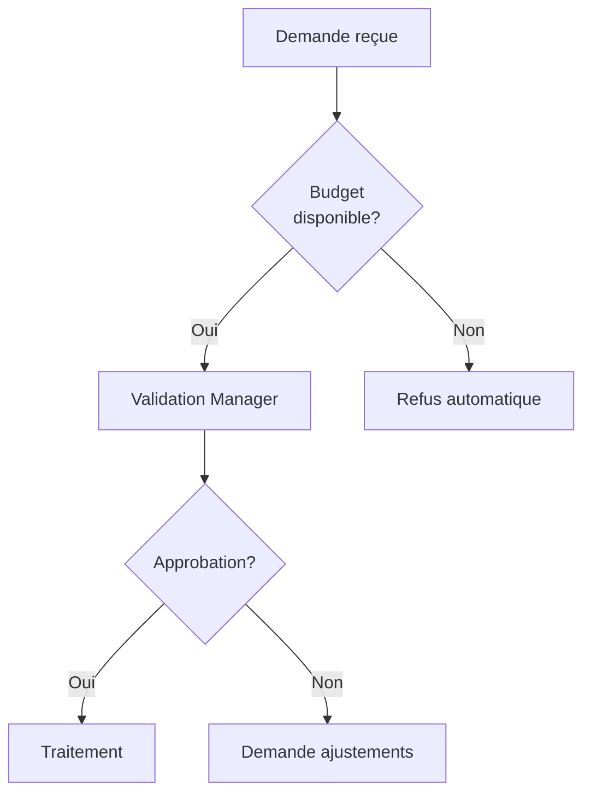

# Output Style: Documentation Processus

**Usage:** Workflows métier, procédures internes, SOP  
**Audience:** Équipes opérationnelles, métier  
**Ton:** Clair, directif, orienté action

---

## Principes Généraux

1. **Action-oriented** — Chaque section = tâche à accomplir
2. **Responsabilités claires** — Qui fait quoi, quand
3. **Décisions documentées** — Arbres de décision, critères
4. **Mesurable** — KPIs, seuils, délais explicites
5. **Exceptions gérées** — Cas limites et escalades

---

## Structure Processus

1. **Vue d'ensemble** : Objectif, scope, parties prenantes
2. **Diagramme de flux** : Visualisation du processus complet
3. **Étapes détaillées** : Procédures pour chaque étape
4. **Points de décision** : Critères, alternatives, escalades
5. **Rôles et responsabilités** : Matrice RACI
6. **Métriques** : KPIs, SLAs, indicateurs de succès

---

## Éléments Clés

### Diagramme de Flux


### Matrice RACI
| Étape | Demandeur | Manager | Finance | IT |
|-------|-----------|---------|---------|-----|
| Création demande | R | I | - | - |
| Validation | I | A/R | C | - |
| Traitement | I | I | R | C |
| Clôture | I | A | R | - |

**Légende:** R=Réalisateur, A=Autorité, C=Consulté, I=Informé

### Point de Décision
```markdown
## Décision : Approbation Requise ?

**Critères :**
- Budget > 5000€ → Approbation Directeur requis
- Budget > 1000€ → Approbation Manager requis
- Budget ≤ 1000€ → Validation automatique

**Délais :**
- Manager : 48h ouvrées
- Directeur : 5 jours ouvrés
```

---

**Version:** 1.0  
**Date:** 2026-02-28
