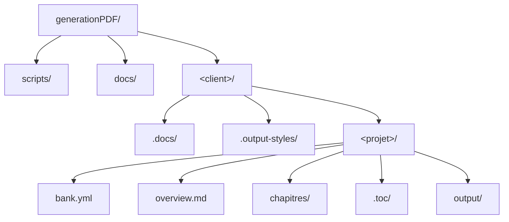

# Chapitre 01 : Introduction & Vue d'ensemble

**Type :** process-doc  
**Output-style :** open-source-guide.md  
**Pages prévues :** 6-8  
**Statut :** À écrire

---

## Synopsis

Présentation d'AIDW, sa valeur et sa différenciation. Ce chapitre répond immédiatement aux questions du lecteur sceptique : qu'est-ce que c'est, pourquoi pas juste ChatGPT, pour qui, et comment ça fonctionne en un coup d'œil. Aucun setup requis pour lire ce chapitre — c'est la vitrine de la méthode.

## Points Clés

- [INTRO] AIDW — définition, valeur, différenciation vs. prompt one-shot et GitHub Copilot
- [INTRO] Pipeline AIDW — Markdown → ICML → InDesign → PDF (vue macroscopique)
- Prérequis : Python 3.10+, Pandoc 3.0+, accès LLM, InDesign optionnel
- Compatibilité : tout LLM, tout OS
- [INTRO] Architecture du dépôt — `<client>/<projet>/`, rôle de `bank.yml`
- Use cases couverts : évaluation, premier projet, maîtrise, extension, maintenance

---

## Sections

### 1. Accroche — Pourquoi AIDW ?

**Objectif :** répondre aux objections implicites avant que le lecteur parte.

Trois questions à adresser dans cet ordre :
1. **"Pourquoi pas juste ChatGPT ?"** — ChatGPT produit un brouillon. AIDW produit un document structuré, relu par des personas, corrigé chirurgicalement, exporté en fichier InDesign. La différence : reproductibilité et pipeline industrialisé.
2. **"Pourquoi pas GitHub Copilot ?"** — Copilot génère du code. AIDW génère de la *documentation* avec une chaîne qualité complète (TOC → écriture → review → corrections → export).
3. **"Pour qui ?"** — Tech ou rédacteur à l'aise avec Git et les LLMs, qui veut structurer sa production documentaire.

> **Ton :** Direct, sans défensive. Énoncer les faits, pas se justifier.

---

### 2. Définition AIDW

**Objectif :** définir AIDW en 3 lignes maximum.

- Méthode open source pour produire des documents professionnels avec un LLM
- Pipeline : Markdown → ICML → InDesign → PDF
- Agnostique LLM (Claude, GPT, Gemini, LLaMA…) et cross-platform (Windows, macOS, Linux)

> **Instruction :** ne pas développer le pipeline ici — renvoyer à la section suivante. La définition doit tenir en un paragraphe court.

---

### 3. Le Pipeline AIDW

**Objectif :** montrer le flux complet en une vue macroscopique.

Présenter le pipeline sous forme de diagramme + explication courte de chaque étape :

```
overview.md → generate-toc → write-* → doctor → build-icml.py → .icml → InDesign → PDF
```

| Étape | Outil | Résultat |
|-------|-------|---------|
| Brief initial | `overview.md` (manuel) | Document source |
| Table des matières | `generate-toc.prompt.md` | `.toc/INDEX.md` |
| Écriture | `write-technical` / `write-user-guide` | `chapitres/*.md` |
| Corrections | `doctor.prompt.md` | Chapitres corrigés |
| Export | `build-icml.py` | `.icml` pour InDesign |
| Mise en page | InDesign (manuel) | PDF haute définition |

> **Instruction :** présenter le tableau comme une référence rapide. Ne pas détailler chaque outil ici — les chapitres suivants le feront.

**Ressource visuelle : Fig 1.1** — diagramme pipeline (voir section Ressources Visuelles)

---

### 4. Prérequis

**Objectif :** liste exhaustive, aucune surprise plus tard.

| Prérequis | Version minimale | Notes |
|-----------|-----------------|-------|
| Python | 3.10+ | Vérification : `python --version` |
| Pandoc | 3.0+ | Vérification : `pandoc --version` |
| LLM | — | Interface web ou API — tout LLM accepté |
| InDesign | 2024+ | Optionnel — uniquement pour mise en page finale |

> **Instruction :** insister sur "optionnel" pour InDesign — c'est une objection fréquente. L'export ICML est la limite d'AIDW ; la mise en page reste à l'utilisateur.

---

### 5. Architecture du Dépôt

**Objectif :** montrer comment le dépôt est organisé, quel fichier joue quel rôle.

Structure type d'un projet AIDW :

```
generationPDF/
├── scripts/          # Scripts Python (build-icml, extract-pdf…)
├── docs/             # Prompts, templates, agents, output-styles
├── <client>/
│   ├── .docs/        # CLIENT.md, glossaire.md
│   ├── .output-styles/
│   └── <projet>/
│       ├── bank.yml  # Config projet (obligatoire)
│       ├── overview.md
│       ├── chapitres/
│       ├── .toc/
│       └── output/
```

**Rôle de `bank.yml` :** fichier de configuration central. Il déclare le type de document, l'output-style, les personas de review, les chemins de sortie ICML. Tous les prompts le lisent en premier.

**Ressource visuelle : Fig 1.2** — architecture dépôt (voir section Ressources Visuelles)

> **Instruction :** ne pas détailler chaque dossier — juste le rôle de `bank.yml` et la logique `<client>/<projet>/`. Le reste est expliqué au Chapitre 03.

---

### 6. Use Cases Couverts

**Objectif :** permettre au lecteur d'identifier son point d'entrée.

| Use case | Chapitre de référence |
|----------|-----------------------|
| Évaluer AIDW en 10 minutes | Ce chapitre + README.md |
| Configurer son environnement | Chapitre 02 |
| Produire un premier document ICML | Chapitre 03 |
| Maîtriser le pipeline complet | Chapitres 04-06 |
| Ajouter un client ou un output-style | Chapitre 07 |
| Maintenir un projet sur la durée | Chapitre 08 |

> **Instruction :** présenter ce tableau en fin de chapitre comme guide de navigation. Ton direct : "Si tu veux X, va au chapitre Y."

---

## Termes Clés

| Terme | Définition |
|-------|-----------|
| AIDW | AI Documentation Writing — méthode structurée de production documentaire avec LLM |
| Pipeline | Flux complet de production : overview → TOC → écriture → review → export |
| bank.yml | Fichier de configuration projet AIDW (type, output-style, personas, chemins) |
| ICML | InCopy Markup Language — format d'échange entre AIDW et InDesign |
| output-style | Fichier définissant le ton, le format et les conventions d'écriture pour un type de doc |
| persona | Profil de lecteur humain utilisé pour évaluer la qualité d'un chapitre |
| LLM | Large Language Model — tout modèle de langage (Claude, GPT, Gemini, LLaMA…) |

---

## Ressources Visuelles

### Tableau des assets

| Figure | Titre | Fichier | Outil | Priorité |
|--------|-------|---------|-------|----------|
| Fig 1.1 | Pipeline AIDW complet | `output/diagrams/ch01-pipeline.png` | `mermaid-to-images.py` (diagram) | Must-have |
| Fig 1.2 | Architecture du dépôt | `output/diagrams/ch01-repo-structure.png` | `mermaid-to-images.py` (diagram) | Recommandé |

### Specs diagrammes (Mermaid)




### Refs markdown (pour write-technical)

```markdown
<!-- TODO: générer via mermaid-to-images.py -->

*Figure 1.1 : Pipeline AIDW complet — de l'overview.md au PDF final*

<!-- TODO: générer via mermaid-to-images.py -->

*Figure 1.2 : Structure du dépôt AIDW — organisation client/projet*
```

---

## Connexions

- **Précédent :** Premier chapitre — pas de chapitre précédent
- **Suivant :** Chapitre 02 (Installation & Configuration) — ce chapitre pose les concepts, le suivant installe l'environnement. Transition naturelle : "Maintenant que tu sais ce qu'est AIDW, voici comment le mettre en place."

---

## Notes d'Écriture

- **Tutoiement** tout au long — on est en mode communauté open source, pas corporate
- **Différenciation en Section 1** : ne pas commencer par une définition sèche — commencer par les objections. Le lecteur GitHub a déjà vu 100 README qui promettent sans montrer
- **Tableau pipeline (Section 3)** : présenter avant d'expliquer. La vue d'ensemble d'abord, les détails dans les chapitres suivants
- **Prérequis (Section 4)** : chaque prérequis a une commande de vérification. Aucune surprise à l'installation
- **Pas de jargon non défini** : ICML, bank.yml, output-style, persona — tous définis dans la section Termes Clés avant première utilisation dans le texte
- **InDesign = optionnel** : le répéter deux fois — dans les prérequis et dans la section pipeline. C'est une objection fréquente
- **Use cases (Section 6)** : ton directif — "Si tu veux X, va au chapitre Y." Pas de circonvolutions
- **Appel à l'action en fin de chapitre** : la Section 6 (use cases) doit se terminer par une phrase d'action claire vers le Chapitre 02 — `github-discoverer` a besoin d'un "next step" explicite, pas d'un tableau qui se clôt sans direction
