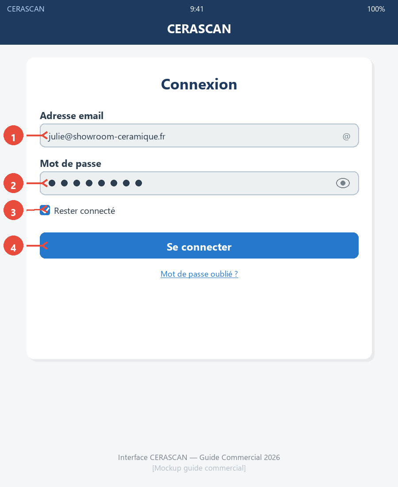
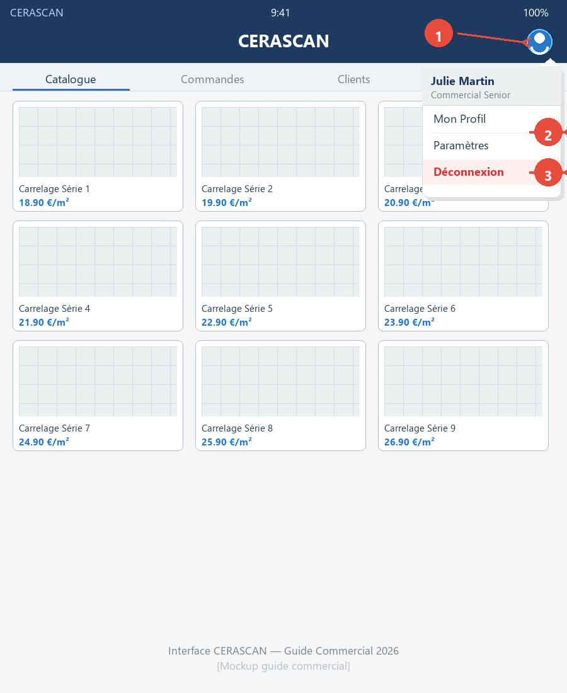
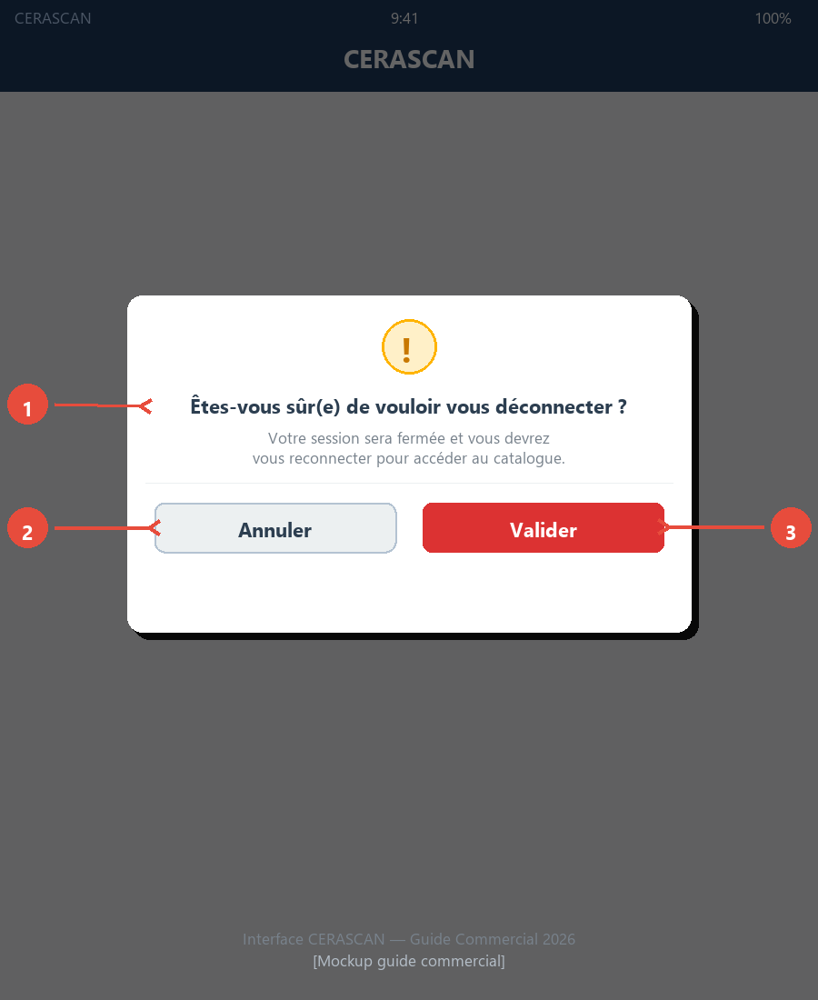

# Se Connecter

## Accéder à l'Application

Deux moyens d'accès rapides pour ouvrir CERASCAN sur votre smartphone ou tablette showroom :

```
┌────────────────────────────────────────────────────────┐
│ 🔗 COMMENT ACCÉDER À L'APPLICATION ?                   │
├────────────────────────────────────────────────────────┤
│                                                        │
│  URL Navigateur                                        │
│  https://{partenaire}.cerascan.fr                     │
│  • Quand : Backup si QR code absent                   │
│  • Durée : 10-15 secondes (saisie manuelle)           │
│  • Astuce : Ajouter favoris navigateur (1 clic)       │
│                                                        │
│  ────────────────── OU ──────────────────              │
│                                                        │
│  QR Code Comptoir Showroom                             │
│  [Scanner appareil photo smartphone/tablette]          │
│  • Quand : Usage quotidien (plus rapide)              │
│  • Durée : < 2 secondes                                │
│  • Astuce : QR code collé comptoir visible clients    │
│                                                        │
└────────────────────────────────────────────────────────┘
```

**💡 Astuce Rapide** : Le QR code est le moyen le plus rapide pour votre usage quotidien. Ajoutez aussi l'URL en favori navigateur comme solution de secours.

---

## Identifiants Commercial

Vos identifiants de connexion sont fournis par le propriétaire showroom lors de votre formation 30 minutes :

**Email professionnel showroom :**
- Exemple : *julie@showroom-ceramique.fr*
- Format : adresse email professionnelle showroom (pas votre email personnel)

**Mot de passe temporaire :**
- Exemple : *CERASCAN2024!*
- Format : mot de passe générique sécurisé
- **Important :** Vous devrez le changer obligatoirement lors de votre premier login (voir section suivante)

```
┌────────────────────────────────────────────────────────┐
│ ⓘ CRÉATION IDENTIFIANTS                                │
├────────────────────────────────────────────────────────┤
│ Propriétaire showroom → Interface partenaire           │
│ → Section "Utilisateurs" → Crée votre compte          │
│                                                        │
│ Vous NE POUVEZ PAS :                                   │
│ ✗ Créer votre compte vous-même                        │
│ ✗ Réinitialiser votre mot de passe seul               │
│                                                        │
│ En cas de problème → Contacter propriétaire showroom  │
└────────────────────────────────────────────────────────┘
```

---

## Premier Login Sécurisé

Lors de votre première connexion, vous devez obligatoirement changer le mot de passe temporaire :

```
┌────────────────────────────────────────────────────────┐
│ 🔐 PROCÉDURE PREMIER LOGIN                             │
├────────────────────────────────────────────────────────┤
│                                                        │
│  [1] Saisissez identifiants sur page connexion        │
│      Email + mot de passe temporaire                   │
│                    ↓                                   │
│  [2] Page "Changer mot de passe" s'affiche            │
│      Automatique (pas de redirection catalogue)        │
│                    ↓                                   │
│  [3] Remplissez 3 champs obligatoires                 │
│      • Mot de passe temporaire (fourni propriétaire)  │
│      • Nouveau mot de passe (votre choix, min 8 car.) │
│      • Confirmation nouveau mot de passe (identique)  │
│                    ↓                                   │
│  [4] Cliquez "Valider"                                 │
│      Message "Mot de passe changé, connexion auto"    │
│      → Redirection catalogue produits                  │
│                                                        │
└────────────────────────────────────────────────────────┘
```

> **⚠️ Attention**  
> Choisissez un mot de passe que vous pouvez mémoriser facilement — vous l'utiliserez chaque jour. Ne le partagez jamais avec vos collègues, même si vous partagez la tablette showroom.

---

## Page Connexion

Une fois le mot de passe initial changé, voici les éléments de la page de connexion quotidienne :

<!-- TODO: AJOUTER CAPTURE ÉCRAN
Fichier: screenshots/guide-commercial-ch02-page-connexion.png
Vue: Interface mobile/tablette CERASCAN page connexion
Annotations requises:
  (1) Champ Email avec exemple julie@showroom-ceramique.fr
  (2) Champ Mot de passe avec icône œil masquer/afficher
  (3) Case "Rester connecté" cochable
  (4) Bouton "Se connecter" bleu/vert visible
Flèches rouges pointant chaque élément numéroté
-->


*Figure 2.1 : Page connexion quotidienne CERASCAN — (1) Champ Email, (2) Champ Mot de passe avec icône œil, (3) Case "Rester connecté", (4) Bouton "Se connecter"*

**Champs de saisie :**
- **Email** : Votre adresse email professionnelle showroom (ex : *julie@showroom-ceramique.fr*)
- **Mot de passe** : Votre mot de passe personnel (masqué, icône œil pour afficher/masquer)

**Bouton "Se connecter" :**
- Cliquez pour valider vos identifiants
- **Connexion réussie** → Redirection automatique vers le catalogue produits (pas de page intermédiaire)

**Case "Rester connecté" :**

```
┌────────────────────────────────────────────────────────┐
│ ⚠️ CASE "RESTER CONNECTÉ"                              │
├────────────────────────────────────────────────────────┤
│                                                        │
│  Tablette showroom fixe                                │
│  ✓ RECOMMANDÉ                                          │
│  • Pas de ressaisie identifiants chaque jour          │
│  • Session active 30 jours                             │
│                                                        │
│  ────────────────────────────────────                 │
│                                                        │
│  Smartphone personnel commercial                       │
│  ✗ DÉCONSEILLÉ                                         │
│  • Risque sécurité si perte/vol smartphone            │
│  • Données clients accessibles tiers                   │
│                                                        │
└────────────────────────────────────────────────────────┘
```

**Durée session :** Si case cochée, reconnexion automatique pendant 30 jours d'inactivité. Après 30 jours, vous devrez ressaisir vos identifiants.

---

## Se Déconnecter

La déconnexion est nécessaire dans 3 situations :

**Quand se déconnecter :**
- Tablette partagée entre plusieurs commerciaux (obligatoire pour traçabilité consultations)
- Fin de journée showroom (sécurité)
- Avant de prêter la tablette à un visiteur (confidentialité infos privilégiées : prix professionnels, marges)

**Procédure :**

<!-- TODO: AJOUTER CAPTURE ÉCRAN
Fichier: screenshots/guide-commercial-ch02-menu-profil.png
Vue: Interface mobile/tablette CERASCAN avec menu profil ouvert
Annotations requises:
  (1) Icône utilisateur 👤 coin haut droite (à droite logo CERASCAN)
  (2) Dropdown menu profil déroulé
  (3) Bouton "Déconnexion" dans le menu
Flèches rouges pointant chaque élément numéroté
Contexte: Menu ouvert après clic sur icône utilisateur
-->


*Figure 2.2 : Menu profil ouvert — (1) Icône utilisateur 👤 coin haut droite, (2) Menu déroulant, (3) Bouton "Déconnexion"*

<!-- TODO: AJOUTER CAPTURE ÉCRAN
Fichier: screenshots/guide-commercial-ch02-popup-deconnexion.png
Vue: Popup confirmation déconnexion
Annotations requises:
  (1) Message "Êtes-vous sûr(e) de vouloir vous déconnecter ?"
  (2) Bouton "Annuler" gris
  (3) Bouton "Valider" bleu/rouge
Flèches rouges pointant chaque élément numéroté
-->


*Figure 2.3 : Popup confirmation déconnexion — (1) Message confirmation, (2) Bouton "Annuler", (3) Bouton "Valider"*

```
┌────────────────────────────────────────────────────────┐
│ 🚪 DÉCONNEXION                                         │
├────────────────────────────────────────────────────────┤
│                                                        │
│  Menu profil [icône utilisateur 👤 coin haut droite,  │
│  à droite logo CERASCAN]                               │
│              ↓                                         │
│  Bouton "Déconnexion"                                  │
│              ↓                                         │
│  Popup "Êtes-vous sûr(e) ?" → Valider                 │
│              ↓                                         │
│  Redirection page connexion                            │
│                                                        │
└────────────────────────────────────────────────────────┘
```

> **💡 Astuce Rapide**  
> Tablette partagée entre plusieurs commerciaux ? Déconnexion obligatoire après chaque session pour garantir la traçabilité des consultations (qui a vu quoi, quand).

---

## Problèmes Connexion Courants

Si vous rencontrez une erreur, voici les problèmes fréquents et leurs solutions :

```
┌──────────────────────────────────────────────────────────────────────────────┐
│ ⚙️ TROUBLESHOOTING CONNEXION                                                 │
├──────────────────────────────────────────────────────────────────────────────┤
│                                                                              │
│  Problème                    │ Cause                 │ Solution             │
│  ───────────────────────────────────────────────────────────────────────── │
│  Mot de passe oublié         │ Mémorisation          │ Contacter proprié-   │
│                              │ personnelle           │ taire showroom →     │
│                              │                       │ Réinitialisation     │
│  ───────────────────────────────────────────────────────────────────────── │
│  Compte bloqué               │ 5 tentatives          │ Contacter proprié-   │
│  "Compte temporairement      │ échouées              │ taire showroom →     │
│  bloqué"                     │ (sécurité)            │ Déblocage manuel     │
│                              │ Blocage 30 min        │ (aucun déblocage     │
│                              │                       │ automatique)         │
│  ───────────────────────────────────────────────────────────────────────── │
│  URL application erronée     │ URL incorrecte        │ Vérifier email       │
│  Erreur 404                  │ saisie                │ propriétaire :       │
│                              │                       │ https://partner808.  │
│                              │                       │ cerascan.fr          │
│  ───────────────────────────────────────────────────────────────────────── │
│  Page connexion charge       │ Internet showroom     │ Attendre 10-15 sec.  │
│  lentement                   │ instable              │ Si échec → proprié-  │
│                              │                       │ taire (vérif Wi-Fi)  │
│                                                                              │
└──────────────────────────────────────────────────────────────────────────────┘
```

**Hiérarchie support :** Toutes les résolutions passent par le propriétaire showroom. Vous ne gérez pas votre compte commercial seul (réinitialisation, déblocage, création).

---

**Prêt à explorer le catalogue ?** Passez au Chapitre 3 pour apprendre à consulter les produits disponibles.
