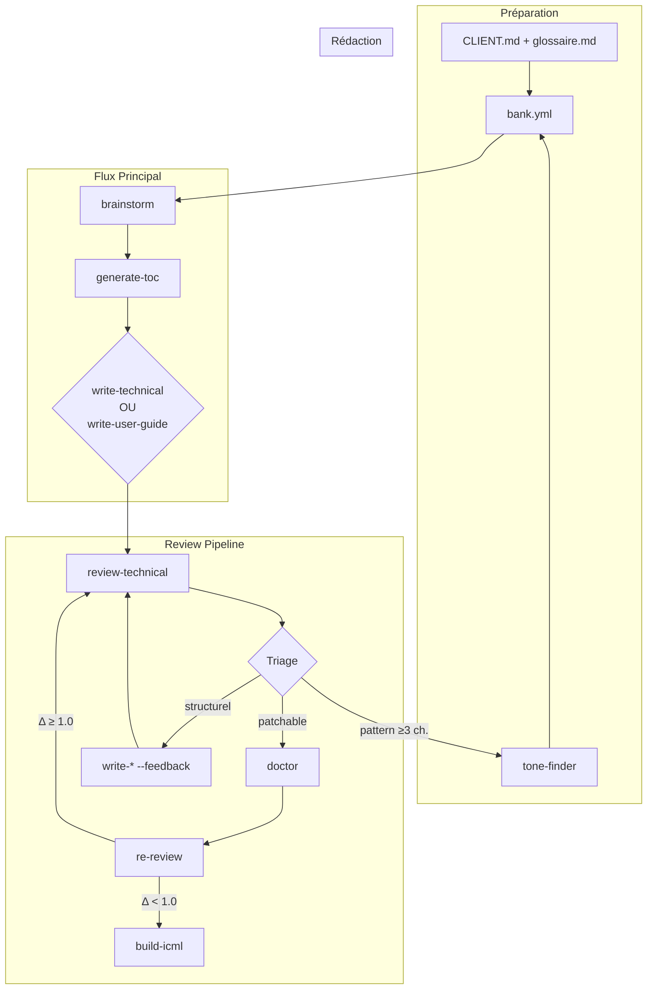
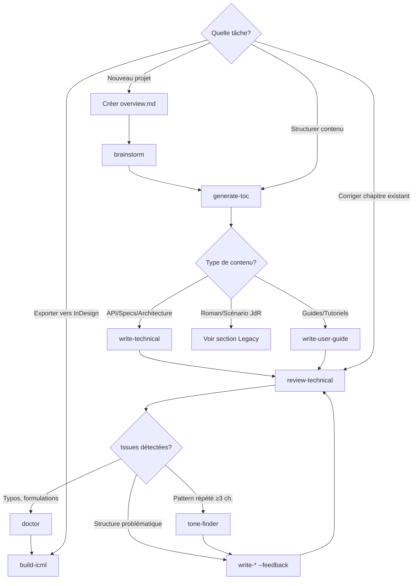

# Workshop: Writing System for Professional Documentation

Système de prompts interconnectés pour la génération de documentation technique et de contenu professionnel.

---

## Vue d'Ensemble



**Principe fondamental :** Un chapitre est une **unité structurelle de pagination** (PAO/InDesign), pas un genre littéraire.

---

## Quick Start : Premier Projet en 5 Minutes

### Créer une Documentation API en 3 Chapitres

```bash
# 1. Créer structure projet
cd generationPDF
mkdir -p acme-corp/api-v2/.docs
mkdir -p acme-corp/api-v2/.toc
mkdir -p acme-corp/api-v2/chapitres
mkdir -p acme-corp/api-v2/output

# 2. Copier template configuration
cp docs/templates/bank.yml acme-corp/api-v2/

# 3. Éditer bank.yml (adapter les chemins)
# document.name: "Documentation API v2"
# document.client: "acme-corp"
# document.type: "technical-doc"
# output-style.global: "docs/output-styles/technical-formal.md"
# docs.client: "acme-corp/.docs/CLIENT.md"
# docs.glossaire: "acme-corp/.docs/glossaire.md"

# 4. Créer overview.md (brief du document)
# Décrire le contexte, l'audience, les objectifs

# 5. Générer table des matières
@docs/prompts/workshop/generate-toc.prompt.md acme-corp/api-v2/overview.md

# 6. Écrire chapitre 1
cd acme-corp/api-v2
@docs/prompts/workshop/write-technical.prompt.md 1

# 7. Réviser
@docs/prompts/workshop/review-technical.prompt.md chapitres/chapitre01.md

# 8. Corriger si nécessaire
@docs/prompts/workshop/doctor.prompt.md chapitres/chapitre01.md

# 9. Exporter en ICML pour InDesign
python ../../scripts/build-icml.py --project "acme-corp/api-v2"

# 10. Ouvrir ICML dans InDesign → Appliquer maquette → Exporter PDF
```

**Résultat :** `acme-corp/api-v2/output/api-v2.icml` prêt pour InDesign

---

## Arbre de Décision : Quel Prompt Utiliser ?



**Guides rapides par cas d'usage :**

| Je veux... | J'utilise... | Notes |
|-----------|-------------|-------|
| Documenter une API REST | `write-technical` | Output-style: `technical-formal.md` |
| Écrire guide installation | `write-user-guide` | Output-style: `user-friendly.md` |
| Spécifier architecture | `write-technical` | Output-style: `developer-docs.md` |
| Documenter processus métier | `write-user-guide` | Output-style: `process-documentation.md` |
| Corriger typos/formulations | `doctor` | Corrections chirurgicales |
| Restructurer complètement | `write-* --feedback` | Réécriture depuis TOC |
| Analyser style problématique | `tone-finder` | Génère nouveau output-style |

---

## Philosophie : Chapitre = Unité PAO

**Principe :** Un chapitre est une **unité structurelle de pagination**, pas un genre littéraire.

`chapitres/chapitre01.md` peut contenir :
- Documentation technique (API, architecture)
- Guide utilisateur (installation, configuration)
- Processus métier (workflows, SOP)
- Contenu narratif (roman, scénario JdR) — legacy

**Séparation des responsabilités :**
```
chapitres/          ← Structure physique (PAO/InDesign)
output-styles/      ← Conventions d'écriture (ton, format)
prompts/            ← Méthode de génération (processus)
personas/           ← Critères qualité (validation)
```

**Pourquoi cette architecture ?**
- `build-icml.py` est hardcodé pour `chapitres/` (pas de refactoring nécessaire)
- Flexibilité : même structure pour tous types de contenus
- Simplicité : un seul workflow PAO, personnalisable via output-styles

---

## Flux de Travail

### Flux Principal (Documentation Technique)

```
overview.md → brainstorm → generate-toc → .toc/INDEX.md
                                        → .toc/toc-chapter<NN>.md

.toc/ → write-technical → chapitres/chapitre<NN>.md
     → write-user-guide

chapitres/ → review-technical → .wip/comments/ (personas)
                             → triage

triage → doctor (patchable) → chapitres/ (corrections)
      → write-* --feedback (structurel) → chapitres/ (réécriture)
      → tone-finder (pattern ≥3 ch.) → output-style v+1

chapitres/ → build-icml → output/*.icml → InDesign → PDF
```

### Review Pipeline (Détail)

**Artefacts générés dans `.wip/` :**
- `comments/chapitre<NN>-personas.md` — Scores et analyse personas
- `changelog/chapitre<NN>-changelog.md` — Corrections appliquées
- `reports/` — Rapports doctor et tone-finder

**Triage des issues :**
- **Patchables** (typos, formulations, clarifications) → `doctor`
- **Structurelles** (≥2 personas plafonnées) → `write-* --feedback`
- **Systémiques** (pattern répété ≥3 chapitres) → `tone-finder` → output-style v+1

**Critère de plateau :** Si Δ score < 1.0 après correction → accepter et passer à `build-icml`

### Flux Client (Préparation)

**Pour nouveau client :**

1. Créer `<client>/.docs/CLIENT.md`
   - Contexte, audience cible, contraintes techniques

2. Créer `<client>/.docs/glossaire.md`
   - Termes métier, vocabulaire technique

3. Adapter output-styles (optionnel)
   - Copier depuis `docs/output-styles/`
   - Personnaliser selon charte graphique client

4. Créer premier projet
   - `<client>/<nom-projet>/`
   - Suivre Quick Start

---

## Prompts Disponibles

### Documentation Technique (Primaire)

| Prompt | Description | Usage |
|--------|-------------|-------|
| **brainstorm** | Élaboration concept | `@docs/prompts/workshop/brainstorm.prompt.md <projet>` |
| **generate-toc** | Génération TOC | `@docs/prompts/workshop/generate-toc.prompt.md <source.md>` |
| **write-technical** | Rédaction technique formelle | `@docs/prompts/workshop/write-technical.prompt.md <n> [--feedback <file>]` |
| **write-user-guide** | Rédaction guide utilisateur | `@docs/prompts/workshop/write-user-guide.prompt.md <n> [--feedback <file>]` |
| **review-technical** | Review technique | `@docs/prompts/workshop/review-technical.prompt.md chapitre<NN>.md` |
| **doctor** | Corrections chirurgicales | `@docs/prompts/workshop/doctor.prompt.md chapitre<NN>.md` |
| **tone-finder** | Analyse style | `@docs/prompts/workshop/tone-finder.prompt.md <client> [sources]` |

### Utilitaires

| Prompt | Description | Usage |
|--------|-------------|-------|
| **research** | Recherche thématique | `@docs/prompts/workshop/research.prompt.md "sujet"` |
| **upgrade** | Mise à jour système | `@docs/prompts/workshop/upgrade.prompt.md` |
| **tabula-rasa** | Reset projet | `@docs/prompts/workshop/tabula-rasa.prompt.md <projet>` |

---

## Output-Styles

### Documentation Technique

| Style | Audience | Ton | Usage |
|-------|----------|-----|-------|
| **technical-formal** | Développeurs, architectes | Objectif, précis, formel | Spécifications, architecture, API |
| **user-friendly** | Utilisateurs finaux | Accessible, pédagogique | Guides, tutoriels, manuels |
| **developer-docs** | Développeurs pratiques | Code-first, exemples concrets | SDK, quick start, intégrations |
| **process-documentation** | Équipes opérationnelles | Directif, action-oriented | Workflows métier, SOP, procédures |

**Localisation :**
- Globaux : `docs/output-styles/`
- Par client : `<client>/.output-styles/` (adaptés selon charte)

---

## Personas

### Personas Techniques

| Persona | Focus | Cas d'usage |
|---------|-------|-------------|
| **technical-reviewer** | Exactitude technique, sécurité, versions | Documentation API, spécifications |
| **clarity-expert** | Compréhensibilité, jargon, structure | Guides utilisateur, tutoriels |
| **compliance-checker** | Exhaustivité, conformité TOC, cohérence | Tous types de docs |

**Grilles d'évaluation :** `/40 (exactitude) + /20 (clarté) + /20 (sécurité) + /20 (complétude) = /100 → /20`

---

## Configuration: bank.yml

### Exemple : Documentation API

```yaml
document:
  name: "Documentation API v2"
  client: "acme-corp"
  type: "technical-doc"  # technical-doc | user-guide | api-doc | process-doc

output-style:
  global: "docs/output-styles/technical-formal.md"

docs:
  client: "acme-corp/.docs/CLIENT.md"
  glossaire: "acme-corp/.docs/glossaire.md"

toc:
  fichier: ".toc/INDEX.md"

icml:
  chapitres-source: "chapitres/"
  output: "output/api-documentation.icml"
```

**Template complet :** `docs/templates/bank.yml`

---

## Structure Projet

```
<client>/<projet>/
├── .docs/
│   ├── context.md             # Contexte projet
│   ├── sources/               # Docs existantes, PDFs, captures
│   └── document-rules.md      # Règles spécifiques
├── .toc/
│   ├── INDEX.md               # Structure générale
│   └── toc-chapter<NN>.md     # Détails par chapitre
├── .wip/                      # Artefacts review (temporaires)
│   ├── comments/              # Évaluations personas
│   ├── changelog/             # Corrections appliquées
│   └── reports/               # Rapports doctor/tone-finder
├── chapitres/                 # Source de vérité (markdown)
│   ├── chapitre01.md
│   └── chapitre02.md
├── output/
│   ├── *.icml                 # Générés par build-icml.py
│   ├── diagrams/              # PNG diagrammes
│   └── releases/              # PDFs finaux versionnés
├── bank.yml                   # Configuration projet
└── overview.md                # Brief initial
```

**Principe :** Un chapitre = unité structurelle PAO, contenu agnostique.

---

## Pipeline ICML (Export PAO)

```
chapitres/*.md → build-icml.py → *.icml → InDesign → PDF HD
```

**Commande :**
```bash
python scripts/build-icml.py --project "<client>/<projet>"
```

**Options :**
- `--output-name` : Nom ICML personnalisé
- `--no-concat` : Un ICML par chapitre
- `--open` : Ouvrir après génération
- `--dry-run` : Simulation

**Workflow complet :**
1. Écrire/corriger dans `chapitres/*.md`
2. Exécuter `build-icml.py`
3. Ouvrir `output/*.icml` dans InDesign
4. Appliquer maquette (styles de paragraphe, polices, couleurs)
5. Exporter en PDF haute définition

**Documentation complète :** `docs/memory-bank/indesign-workflow.md`

---

## Agents Autonomes

| Agent | Description | Usage |
|-------|-------------|-------|
| **writing-pipeline** | Génération parallèle chapitres | `@docs/agents/writing-pipeline.md <chapitres> [--parallel]` |
| **memory-manager** | Gestion memory-bank | `@docs/agents/memory-manager.md <fichier>` |

**Exemple :**
```bash
# Générer chapitres 02-07 en parallèle
@docs/agents/writing-pipeline.md 2-7 --parallel
```

---

## Troubleshooting

### build-icml.py échoue

**Symptômes :** `FileNotFoundError: chapitres/`

**Causes possibles :**
1. Dossier `chapitres/` n'existe pas
2. `bank.yml` mal configuré (chemin `icml.chapitres-source` incorrect)
3. Aucun fichier `.md` dans `chapitres/`

**Solutions :**
```bash
# Vérifier structure
ls chapitres/

# Vérifier bank.yml
cat bank.yml | grep chapitres-source
# Doit contenir: chapitres-source: "chapitres/"

# Créer dossier si manquant
mkdir chapitres
```

### Personas plafonnés (scores < 12/20)

**Symptômes :** `review-technical` donne des scores faibles, multiples plafonnements

**Causes :**
- Issues structurelles (TOC non respectée)
- Manque de clarté/exemples
- Erreurs techniques répétées

**Solutions :**
```bash
# Option 1: Corrections chirurgicales (si issues mineures)
@docs/prompts/workshop/doctor.prompt.md chapitres/chapitre01.md

# Option 2: Réécriture informée (si issues structurelles)
@docs/prompts/workshop/write-technical.prompt.md 1 --feedback .wip/comments/chapitre01-personas.md

# Option 3: Pattern systémique (≥3 chapitres concernés)
@docs/prompts/workshop/tone-finder.prompt.md <client> chapitres/chapitre*.md
# → Génère output-style v+1 → réécrire tous les chapitres concernés
```

### Plateau qualité (Δ < 1.0)

**Symptômes :** Après plusieurs itérations doctor, score n'augmente plus

**Cause :** Limite qualitative atteinte avec l'output-style actuel

**Solutions :**
1. **Accepter** si score ≥ 14/20 → passer à `build-icml`
2. **Changer output-style** si pattern systémique
3. **Réécriture manuelle** si chapitre critique

### InDesign n'ouvre pas l'ICML

**Symptômes :** Erreur d'import InDesign

**Causes :**
1. ICML mal formé (balises XML invalides)
2. Encodage incorrect (doit être UTF-8)
3. Caractères spéciaux non échappés

**Solutions :**
```bash
# Vérifier encodage
file output/*.icml
# Doit afficher: UTF-8 Unicode

# Valider XML
xmllint --noout output/*.icml

# Régénérer avec --dry-run
python scripts/build-icml.py --project "<client>/<projet>" --dry-run
```

### Contenu extrait d'un PDF mal formaté

**Symptômes :** Extraction PDF produit du texte déstructuré

**Solutions :**
1. Utiliser `extract-pdf` phase par phase (A → B → C)
2. Vérifier `progress.md` entre chaque phase
3. Utiliser `extract-debug` si blocage
4. Nettoyer manuellement les chunks problématiques

---

## Legacy : Contenu Narratif (JdR/Romans)

### Prompts Legacy

| Prompt | Description | Usage |
|--------|-------------|-------|
| **write-novel** | Rédaction narrative | `@docs/prompts/workshop/write-novel.prompt.md <n> [--feedback <file>]` |
| **write-roleplaying** | Rédaction JdR | `@docs/prompts/workshop/write-roleplaying.prompt.md <n> [--feedback <file>]` |
| **review-chapter** | Review narratif | `@docs/prompts/workshop/review-chapter.prompt.md chapitre<NN>.md` |
| **review-roleplay** | Review JdR | `@docs/prompts/workshop/review-roleplay.prompt.md chapitre<NN>.md` |

### Output-Styles Legacy

- `<univers>-novel.md` : Narration immersive
- `<univers>-scenario.md` : Scénarios JdR structurés

### Personas Legacy

- **casual-reader** : Engagement, fluidité narrative
- **mj-curieux** : Utilisabilité JdR
- **fan-wot** : Cohérence univers

### Configuration Legacy

```yaml
document:
  name: "La Reine des Lumières"
  client: "archipels"  # Ancien: "univers"
  type: "novel"  # novel | roleplaying

output-style:
  global: "archipels/.output-styles/archipels-novel.md"

docs:
  client: "archipels/.docs/UNIVERS.md"  # Ancien: "index"
  glossaire: "archipels/.docs/terminologie.md"
```

**Note :** Tous les anciens projets `<univers>/<projet>` continuent de fonctionner. La terminologie a changé (`univers` → `client`, `terminologie` → `glossaire`) mais la structure reste identique.

---

## Références

- **CLAUDE.md** : Documentation complète du système
- **Structure détaillée :** `docs/memory-bank/project-structure.md`
- **Workflow InDesign :** `docs/memory-bank/indesign-workflow.md`
- **Extraction PDF :** `docs/memory-bank/workflows/extraction-workflow.md`
- **Prompts détaillés :** `docs/prompts/workshop/README.md`

---

**Version:** 6.1  
**Date:** 2026-02-28  
**Focus:** Documentation technique multi-clients, pipeline ICML/InDesign, personas techniques  
**Changelog 6.1:** Refactoring complet README (suppression duplications, ajout Quick Start, arbre de décision, troubleshooting, section legacy séparée). 678 lignes → 420 lignes (-38%).
