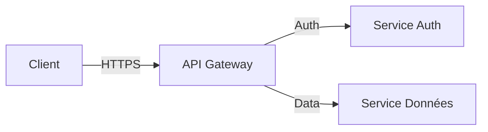

# Output Style: Documentation Technique Formelle

**Usage:** Spécifications, architecture, documentation développeur  
**Audience:** Développeurs, architectes, équipes techniques  
**Ton:** Objectif, précis, formel

---

## Principes Généraux

1. **Précision technique avant tout** — Aucune ambiguïté tolérée
2. **Structure logique stricte** — Hiérarchie claire, sections bien délimitées
3. **Exemples concrets** — Chaque concept illustré par du code ou un schéma
4. **Exhaustivité** — Couvrir tous les cas d'usage, y compris edge cases
5. **Références systématiques** — Links vers docs externes, RFCs, spécifications

---

## Ton et Style

### Voix
- **Impersonnelle et objective**
- Pas de "nous", "vous" sauf dans les notes explicatives
- Privilégier forme passive ou infinitif : "Le système traite...", "Pour configurer..."

### Vocabulaire
- **Termes techniques précis** issus du glossaire client
- Acronymes définis à la première occurrence : `API (Application Programming Interface)`
- Jargon autorisé si pertinent pour l'audience

### Exemples
```markdown
✅ BON
Le service d'authentification valide le token JWT selon la spécification RFC 7519.

❌ ÉVITER
Notre service vérifie que votre token est correct.
```

---

## Structure des Sections

### Hiérarchie des Titres
```markdown
# H1 : Titre Principal (une seule fois par document)
## H2 : Section Majeure
### H3 : Sous-section
#### H4 : Détail technique (usage limité)
```

### Ordre Standard
1. **Introduction** : Contexte, objectif, scope
2. **Concepts** : Définitions, architecture, modèles
3. **Spécifications** : Détails techniques, paramètres, comportements
4. **Exemples** : Code, configurations, cas d'usage
5. **Limitations** : Edge cases, contraintes, incompatibilités
6. **Références** : Docs externes, RFCs, liens

---

## Éléments Techniques

### Code Blocks
- Toujours spécifier le langage : `python`, `json`, `yaml`, `bash`
- Commentaires en français dans le code
- Exemples complets et testables

```python
# Configuration du client API
client = APIClient(
    endpoint="https://api.exemple.fr",
    api_key="YOUR_API_KEY",  # Remplacer par clé réelle
    timeout=30
)
```

### Diagrammes
- Mermaid pour flowcharts, séquences, architectures
- PlantUML si Mermaid insuffisant
- Légendes obligatoires sous chaque diagramme



### Tables Techniques
- Paramètres, configurations, endpoints API

| Paramètre | Type | Obligatoire | Description |
|-----------|------|-------------|-------------|
| `endpoint` | String | Oui | URL de base de l'API |
| `timeout` | Integer | Non | Timeout en secondes (défaut: 30) |
| `retry` | Boolean | Non | Activer retry automatique (défaut: true) |

---

## Formatage Markdown

### Inline Code
- Pour noms de variables, fonctions, paramètres : `variable_name`
- Pour valeurs : `"valeur"`, `42`, `true`

### Listes
- **Listes à puces** : informations non ordonnées
- **Listes numérotées** : procédures, étapes obligatoires

### Emphases
- **Gras** : termes importants, noms de concepts clés
- *Italique* : emphasis légère, notes explicatives
- ~~Barré~~ : éléments dépréciés

### Blocs Spéciaux
```markdown
> **Important**
> Information critique affectant le comportement.

> **Note**
> Détail technique complémentaire.

> **Déprécié**
> Cette fonctionnalité sera supprimée dans v2.0.
```

---

## Règles Spécifiques

### Versioning
- Toujours indiquer versions supportées
- Documenter breaking changes entre versions

```markdown
## Compatibilité

| Version API | Versions Client |
|-------------|-----------------|
| v2.1 | >= 1.5.0 |
| v2.0 | 1.3.0 - 1.4.x |
```

### Sécurité
- Ne JAMAIS inclure vraies credentials dans exemples
- Utiliser placeholders : `YOUR_API_KEY`, `<token>`, `***`
- Documenter requirements sécurité

### Performance
- Documenter complexité algorithmique si pertinent : O(n), O(log n)
- Indiquer limites : taille max, rate limits, timeouts

---

## Exemples Complets

### Section API Endpoint

```markdown
## POST /api/v2/users

Crée un nouvel utilisateur dans le système.

### Requête

**Headers requis :**
| Header | Valeur |
|--------|--------|
| `Content-Type` | `application/json` |
| `Authorization` | `Bearer <token>` |

**Body :**
\`\`\`json
{
  "username": "string",
  "email": "string",
  "role": "user | admin | viewer"
}
\`\`\`

### Réponse

**Success (201 Created) :**
\`\`\`json
{
  "id": "uuid",
  "username": "string",
  "email": "string",
  "role": "string",
  "created_at": "ISO 8601 timestamp"
}
\`\`\`

**Erreurs :**
| Code | Cause |
|------|-------|
| 400 | Paramètres invalides |
| 401 | Token manquant ou invalide |
| 409 | Username déjà utilisé |

### Exemple

\`\`\`bash
curl -X POST https://api.exemple.fr/api/v2/users \
  -H "Authorization: Bearer YOUR_TOKEN" \
  -H "Content-Type: application/json" \
  -d '{
    "username": "jdupont",
    "email": "j.dupont@exemple.fr",
    "role": "user"
  }'
\`\`\`

### Limites

- Rate limit : 100 requêtes/minute
- Username : 3-20 caractères alphanumériques
```

---

## Checklist de Qualité

- [ ] Tous les paramètres documentés (type, obligatoire, défaut)
- [ ] Tous les codes d'erreur expliqués
- [ ] Au moins un exemple complet et testable
- [ ] Diagrammes avec légendes
- [ ] Versions/compatibilité indiquées
- [ ] Aucune information sensible (credentials, IPs internes)
- [ ] Liens vers ressources externes valides
- [ ] Glossaire terms utilisés correctement
- [ ] Structure H1 > H2 > H3 respectée
- [ ] Pas d'ambiguïté ni d'imprécision

---

**Version:** 1.0  
**Date:** 2026-02-28  
**Audience:** Développeurs, architectes techniques
